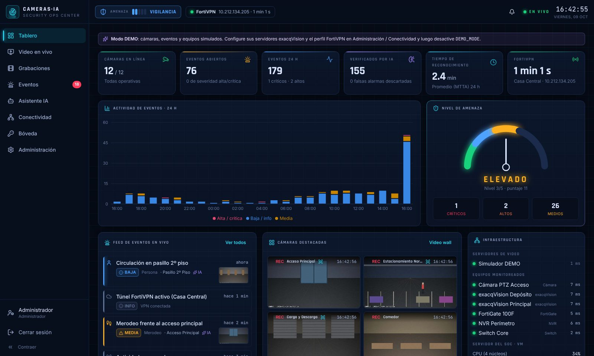
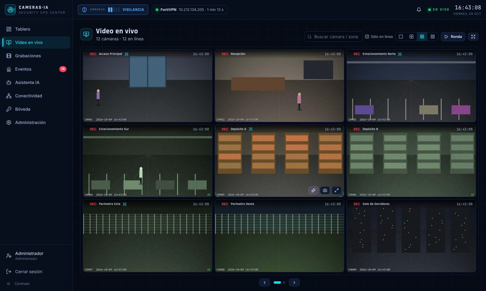
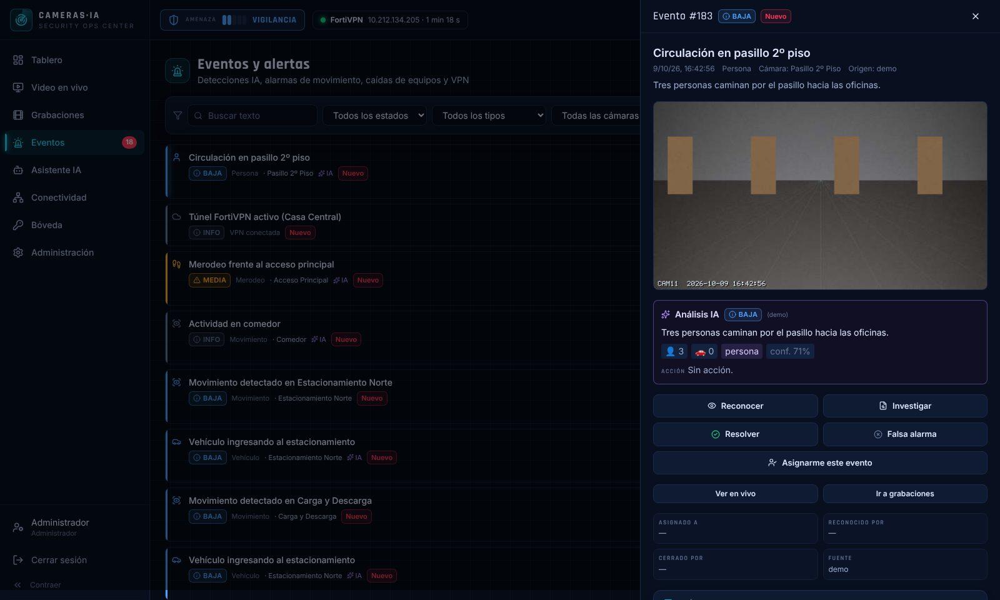
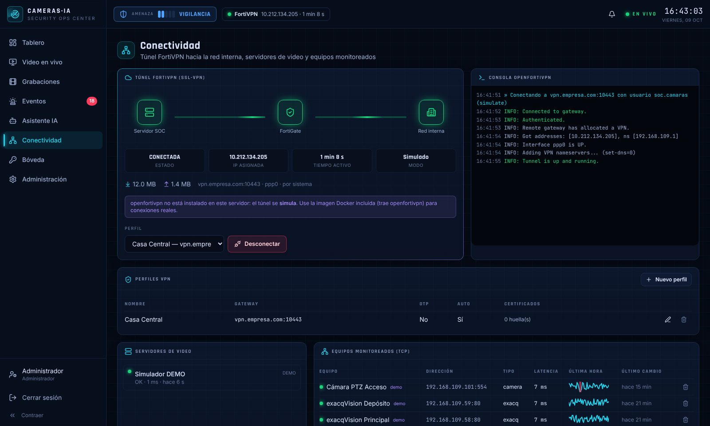

# CamerasIA · Centro de Monitoreo de Seguridad con IA

Plataforma web tipo **NOC/SOC** para operar las cámaras de **exacqVision** de la empresa desde un único lugar seguro: video en vivo, grabaciones, detecciones con IA, alertas en tiempo real, estado de la red y **conexión FortiVPN integrada** (con credenciales guardadas cifradas, para no tener que tipearlas cada vez).



| Video wall | Eventos con análisis IA | Túnel FortiVPN |
|---|---|---|
|  |  |  |

---

## Qué incluye

**Seguridad de acceso**
- Login con usuario/contraseña (**scrypt**, parámetros OWASP) + **2FA TOTP obligatorio** (Google/Microsoft Authenticator, FortiToken Mobile, Authy…) con **códigos de recuperación** de un solo uso.
- Primer ingreso guiado: cambio de contraseña obligatorio → alta de 2FA → códigos de recuperación.
- **Roles**: Administrador, Operador, Observador y **Tester (ChatGPT)** para consultas y diagnósticos con 2FA obligatorio.
- **Re-autenticación 2FA** (step-up) para acciones sensibles: bóveda, perfiles VPN, usuarios, servidores.
- Bloqueo por intentos fallidos, *rate limiting*, protección anti-enumeración de usuarios.
- Sesiones con cookie `HttpOnly + Secure + SameSite=Strict`, expiración por inactividad y absoluta; listado y cierre remoto de sesiones.
- Protección CSRF (cabecera propia + verificación de `Origin`), CSP estricta, HSTS, `no-referrer`, anti-clickjacking.
- **Bitácora de auditoría encadenada con SHA-256** (detecta si alguien la altera en la base) con verificación desde la interfaz.

**Bóveda de credenciales**
- Usuario/contraseña del SSL-VPN de FortiGate, usuario de exacqVision, API key de IA, cámaras y tokens.
- Cifrado **AES-256-GCM** por registro, clave maestra fuera de la base de datos (`VAULT_MASTER_KEY`).
- Los secretos **nunca se envían al navegador**: el servidor los usa en memoria (túnel, exacq, IA). "Revelar" está deshabilitado por defecto.

**FortiVPN integrado**
- El servidor del centro levanta el túnel SSL-VPN con **openfortivpn** (cliente open source compatible con FortiClient) usando la credencial de la bóveda.
- Soporte de **OTP FortiToken**, *pinning* del certificado del FortiGate (huella SHA-256, con confirmación del admin la primera vez), rutas/DNS de la VPN, **reconexión automática**.
- Consola en vivo, IP asignada, tiempo activo y tráfico. La contraseña nunca va en la línea de comandos ni en los logs.

**Video (exacqVision)**
- Varios servidores exacqVision (p. ej. `http://192.168.109.58`), descubrimiento automático de cámaras.
- **Video wall** 1/4/9/16 con ronda automática, pantalla completa, captura de imagen; vista ampliada con MJPEG.
- **Grabaciones**: búsqueda en el archivo, línea de tiempo con los eventos superpuestos, **exportación y reproducción de clips MP4**.
- El navegador nunca habla directo con exacq ni ve sus credenciales: todo pasa por el backend (proxy autenticado).

**Detección e IA (Claude de Anthropic)**
- Motor local de **movimiento y sabotaje** (cámara tapada/cegada) sin costo.
- **Verificación con IA**: cada alarma se confirma con visión artificial, que clasifica (persona, vehículo, intrusión, merodeo…), asigna severidad y **descarta falsas alarmas** (sombras, lluvia, insectos).
- **"Analizar con IA"** en cualquier cámara en vivo o evento.
- **Asistente conversacional del SOC**: consulta eventos, cámaras, VPN y equipos reales y puede **mirar una cámara en vivo** para describirte la escena.
- **Reporte de entrega de turno** automático (Markdown descargable).
- Control de costos: tope de análisis por hora y panel de consumo de tokens.
- **Ingesta de detecciones externas** (Frigate, CodeProject.AI, analíticas de cámaras, scripts) vía API key.

**NOC**
- Tablero con nivel de amenaza (1-5), KPIs, actividad 24 h, feed en vivo (WebSocket), cámaras destacadas, salud de servidores.
- Monitoreo TCP de equipos (exacq, FortiGate, NVR, switches) con latencia e historial.
- Alertas emergentes con **sonido** para severidad alta/crítica; gestión de eventos (reconocer, investigar, resolver, falsa alarma, asignar, notas, CSV).

Todo con interfaz en español, tema oscuro de sala de monitoreo, animaciones y diseño adaptable a celular.

---

## Arquitectura

```
                 Navegador (operadores)
                        │ HTTPS + WebSocket (cookie de sesión, 2FA)
                        ▼
┌──────────────────────────────────────────────────────────────┐
│ CamerasIA (Node.js 22 · Fastify · React)                     │
│  ├─ Autenticación / 2FA / roles / auditoría                  │
│  ├─ Bóveda AES-256-GCM ──────────────┐                       │
│  ├─ Gestor FortiVPN (openfortivpn) ◄─┤ credenciales          │
│  ├─ Cliente exacqVision Web Service ◄┤ en memoria            │
│  ├─ Motor de detección + IA (Claude)◄┘                       │
│  └─ SQLite (eventos, config, auditoría) + capturas           │
└───────┬──────────────────────────┬──────────────────┬────────┘
        │ túnel SSL-VPN (ppp0)     │ HTTP interno     │ HTTPS
        ▼                          ▼                  ▼
   FortiGate ───── LAN ──── exacqVision          api.anthropic.com
                            192.168.109.58         (sólo si usa IA)
```

- **Backend**: `server/` (TypeScript, Fastify 5, `node:sqlite`, Zod, SDK oficial de Anthropic).
- **Frontend**: `web/` (React 19, Vite, Tailwind 4, Recharts, Framer Motion). Se sirve desde el mismo backend.
- **Sin servicios externos obligatorios**: una sola imagen Docker y un volumen de datos.

### ¿Dónde instalarlo? (importante)

El navegador **no puede** levantar un túnel FortiVPN por sí mismo: el túnel lo establece **el servidor** donde corre CamerasIA. Hay dos formas de desplegarlo:

| | **A. Dentro de la red interna (recomendado)** | **B. Fuera de la red, con túnel propio** |
|---|---|---|
| Dónde corre | VM/servidor en la LAN (p. ej. 192.168.109.x) | Servidor/PC fuera de la LAN (oficina remota, nube) |
| Acceso a exacq | Directo | Por el túnel FortiVPN que levanta CamerasIA |
| Acceso de operadores | Por FortiClient VPN / ZTNA, o publicado por FortiGate (VIP + HTTPS) restringido | Directo al servidor de CamerasIA |
| Config | `VPN_MODE=disabled` | `VPN_MODE=auto`, perfil FortiVPN + credencial en la bóveda |

La opción **A** reduce la superficie de ataque (las credenciales de la VPN no salen de la red). La opción **B** es la que permite "conectarse a la VPN desde la web" sin abrir FortiClient en cada PC. Ver [docs/FORTIVPN.md](docs/FORTIVPN.md).

---

## Despliegue rápido en una VPS

Desde su PC, con la carpeta del proyecto (instala Docker, HTTPS, FortiVPN, firewall y respaldos):

```powershell
# Windows (PowerShell)
.\scripts\deploy.ps1 -Destino root@IP_DE_LA_VPS -Dominio soc.suempresa.com -Email usted@suempresa.com
```

```bash
# Linux / macOS / WSL
./scripts/deploy.sh root@IP_DE_LA_VPS --domain soc.suempresa.com --email usted@suempresa.com
```

Al terminar muestra la URL y la contraseña temporal de `admin`. Guía completa (sin dominio, restricción por IP, actualizar, respaldos): **[docs/DESPLIEGUE-VPS.md](docs/DESPLIEGUE-VPS.md)**.

---

## Inicio rápido (modo DEMO)

Con Node.js ≥ 22.13:

```bash
npm install
npm run build
cp .env.example .env            # ajuste valores (ver abajo)
npm start                       # http://localhost:8443
```

El primer arranque crea el usuario `admin` y muestra en el log una **contraseña temporal** (o use `ADMIN_INITIAL_PASSWORD`). Al ingresar se exige cambiarla y activar 2FA. En modo DEMO verá 12 cámaras simuladas con personas/vehículos en movimiento, eventos, equipos y VPN simulada.

Desarrollo con recarga en caliente: `npm run dev` (backend en :8443 y Vite en :5173 con proxy).

### Con Docker

```bash
cp .env.example .env
openssl rand -base64 32         # pegue el valor en VAULT_MASTER_KEY
./scripts/gen-cert.sh soc.empresa.local   # certificado TLS (o use el de su CA)
docker compose up -d --build
docker compose logs camerasia | grep -A3 "administrador inicial"
```

Abra `https://<servidor>:8443`. La imagen incluye `openfortivpn`. Para que el contenedor pueda levantar el túnel (despliegue **B**) agregue el overlay con `NET_ADMIN` y `/dev/ppp`:

```bash
echo "COMPOSE_FILE=docker-compose.yml:docker-compose.vpn.yml" >> .env
docker compose up -d
```

---

## Puesta en marcha con su infraestructura

1. **Bóveda** → *Nueva credencial*:
   - `FortiVPN (SSL-VPN)`: usuario y contraseña del portal SSL-VPN (despliegue B).
   - `exacqVision`: un usuario del exacqVision **de sólo visualización/búsqueda/exportación** (no use el admin).
   - `Anthropic API (IA)`: su API key (opcional; sin ella todo funciona salvo la IA).
2. **Conectividad** → *Nuevo perfil* FortiVPN: gateway (`vpn.empresa.com`), puerto (443/10443), credencial, si usa **FortiToken** marque *Requiere OTP*. Conecte: si el certificado no es de una CA pública, la consola mostrará la **huella SHA-256**; verifíquela contra el FortiGate y pulse *Confiar*.
3. **Administración → Servidores exacqVision** → *Agregar servidor*: `http://192.168.109.58`, credencial, zona horaria y (si aplica) el perfil VPN. Pulse **Probar** y luego **Detectar video** (prueba automáticamente las URLs de imagen/stream de su versión). Detalles en [docs/EXACQVISION.md](docs/EXACQVISION.md).
4. **Administración → Cámaras**: nombres/zonas, active **Detección** y **Verificación IA** en las cámaras críticas (perímetro, depósitos, accesos fuera de horario) y ajuste la sensibilidad.
5. **Administración → IA**: describa el sitio y el horario laboral (mejora mucho el criterio de la IA).
6. **Conectividad → Equipos monitoreados**: agregue FortiGate, servidores exacq, NVR, switches (IP + puerto TCP).
7. **Usuarios**: cree operadores/observadores (cada uno activará su 2FA).
8. Cambie `DEMO_MODE=false` y reinicie.

---

## Seguridad: checklist de producción

- [ ] HTTPS siempre (`TLS_CERT_FILE/TLS_KEY_FILE` o proxy con TLS y `TRUST_PROXY=true`).
- [ ] `VAULT_MASTER_KEY` definido y guardado fuera del servidor (si se pierde, los secretos no se recuperan).
- [ ] No exponer el puerto a Internet sin control: publíquelo sólo por FortiClient/ZTNA o por una VIP del FortiGate con política restringida (IPs de origen, geobloqueo, IPS).
- [ ] Usuario de exacqVision de mínimo privilegio; usuario SSL-VPN dedicado con política del FortiGate que sólo permita llegar a las IPs/puertos de exacq.
- [ ] `REQUIRE_2FA=true` (por defecto) y `VAULT_ALLOW_REVEAL=false`.
- [ ] Respaldo del volumen `/data` (base SQLite + capturas) y de la clave maestra **por separado**.
- [ ] Revisar periódicamente *Administración → Auditoría → Verificar integridad*.

Más detalle y modelo de amenazas en [docs/SEGURIDAD.md](docs/SEGURIDAD.md).

---

## IA y privacidad

- Los cuadros analizados se envían a la API de Anthropic (Claude) sólo cuando: una cámara con **Verificación IA** dispara movimiento, un operador pulsa **Analizar con IA**, o el asistente usa *mirar cámara*. Nada se envía si no hay API key.
- Las instrucciones a la IA prohíben identificar personas o inferir rasgos sensibles: describe vestimenta, objetos y acciones.
- El texto que aparezca dentro de las imágenes se trata como dato, nunca como instrucción.
- Modelo por defecto: `claude-opus-5-5` (configurable con `AI_MODEL`), con *fallback* del lado del servidor si un pedido es rechazado. Tope de análisis por hora: `AI_MAX_ANALYSES_PER_HOUR`.

---

## Integraciones (detecciones externas)

*Administración → Integraciones* crea una API key y muestra el ejemplo:

```bash
curl -X POST https://soc.empresa.local:8443/api/ingest/detections \
  -H "Authorization: Bearer cia_XXXXXXXX" -H "Content-Type: application/json" \
  -d '{"camera":"Acceso Principal","type":"person","severity":"high","title":"Persona fuera de horario","snapshot":"<jpeg base64>","verify":true}'
```

---

## Desarrollo y pruebas

```bash
npm run dev         # backend + frontend con recarga
npm test            # pruebas del backend (node:test)
npm run typecheck   # TypeScript backend + frontend
```

Las pruebas cubren: vectores RFC 6238 de TOTP y anti-replay, scrypt y política de claves, AES-GCM con AAD, bóveda, cadena de auditoría (detección de manipulación), detección de movimiento/sabotaje, cliente exacqVision contra un servidor simulado (incluye re-login automático), configuración de openfortivpn (anti-inyección) y el flujo completo de la API (primer ingreso, 2FA, step-up, CSRF, RBAC, bloqueo, VPN simulada, ingesta).

```
server/src
├── auth/        login, 2FA, sesiones, step-up
├── audit/       bitácora encadenada
├── vault/       bóveda AES-256-GCM
├── vpn/         gestor openfortivpn
├── exacq/       cliente exacqVision, simulador demo, video wall/grabaciones
├── detection/   movimiento/sabotaje + verificación IA + simulador de eventos
├── ai/          Claude: visión, asistente con herramientas, reportes
├── events/      eventos/alertas + ingesta externa
├── health/      monitoreo TCP + métricas del host
└── realtime/    WebSocket
web/src          React (páginas, componentes, gráficos)
```

## Limitaciones conocidas

- La URL de imagen en vivo / stream MJPEG del exacqVision Web Service cambia entre versiones: use **Detectar video** o cópiela desde las herramientas de desarrollador (ver [docs/EXACQVISION.md](docs/EXACQVISION.md)). Login, cámaras, búsqueda y exportación usan los endpoints `v1/*.web` documentados por la comunidad.
- La reproducción de grabaciones genera un MP4 vía `export.web` (no hay *scrubbing* continuo sobre el archivo).
- openfortivpn no soporta login SAML/SSO del FortiGate ni *push* de FortiToken: use usuario + contraseña + código OTP.
- Para muchas cámaras en simultáneo y video fluido conviene sumar un *gateway* de streaming (p. ej. go2rtc/WebRTC) a futuro.
